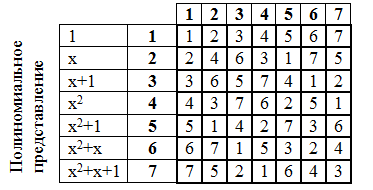

# Поля Галуа

Арифметика полей Галуа — полиномиальная арифметика, то есть каждый элемент данного поля представляет собой некий полином. Результат любой операции также является элементом данного поля. Конкретное поле Галуа состоит из фиксированного диапазона чисел. Характеристикой поля называют некоторое простое число p. Порядок поля, т.е. количество его элементов, является некоторой натуральной степенью характеристики `pm`, где `m ϵ N`. При `m=1` поле называется простым. В случаях, когда `m>1`, для образования поля необходим еще порождающий полином степени `m`, такое поле называется расширенным. $GF (p^m) $ — обозначение поля Галуа. Порождающий полином является неприводимым, то есть простым (по аналогии с простыми числами делится без остатка на 1 и на самого себя). Так как работа с любой информацией — это работа с байтами, а байт представляет из себя 8 бит, в качестве поля берут $GF (2^8)$ и порождающий полином:

$x^8 + x^7 + x^6+x+1$

Однако для начала разберем основные операции в более простом поле $GF (2^3)$ с порождающим полиномом $f(x)=x^3+x+1$.

## Операция сложения

Самой простой является операция сложения, которая в арифметике полей Галуа является простым побитовым сложением по модулю 2 (ХОR).

Сразу обращаю внимание, что знак »+» здесь и далее по тексту обозначает операцию побитового XOR, а не сложение в привычном виде.

Пример: $5 + 3 = 101 + 011 = 110_2 = 6_{10}$

В полиномиальном виде данная операция будет выглядеть как 

$(x^2 + 1) + (x + 1) = x^2 + x = 110_2 = 6_{10}$

## Операция умножения

Чтобы осуществить операцию умножения, необходимо преобразовать числа в полиномиальную форму:

$5 = 101_2 =1*x^2 +0*x^1+1*x^0=x^2 + 1$

Как можно заметить число в полиномиальной форме представляет собой многочлен, коэффициентами которого являются значения разрядов в двоичном представлении числа.

Перемножим два числа в полиномиальной форме:

$5×7=(x^2+1)*(x^2+x+1)=x^4+x^3+x^2+x^2+x+1=$

$=x^4+x^3+x+1=11011_2=27_{10}$

Результат умножения 27 не входит в используемое поле $GF (2^3)$ (оно состоит из чисел от 0 до 7, как было сказано выше). Чтобы бороться с этой проблемой, необходимо использовать порождающий полином.

Также предполагается, что x удовлетворяет уравнению $f(x)=x^3+x+1=0$, тогда

Таблица умножения

Большое значение имеет таблица степеней элементов поля Галуа. Возведение в степень также осуществляется в полиномиальной форме, аналогично умножению.

Пример:

$5^2=(x^2+1)^2=x^4+x^2+x^2+1=x^4+x^2+x+x^2+x+1=x(x^3+x+1)+x^2+x+1=x^2+x+1=111_2=7_{10}$

Таким образом, составим таблицу степеней:

Таблица степеней обладает цикличностью: седьмая степень соответствует нулевой, значит восьмая соответствует первой и т.д. При желании можно это проверить.

В полях Галуа существует понятие примитивного члена — элемент поля, чьи степени содержать все ненулевые элементы поля. Просмотрев таблицу степеней видно, что этому условию соответствуют все элементы (ну кроме 1 естественно). Однако это выполняется не всегда.

Для полей, которые мы рассматриваем, то есть с характеристикой 2, в качестве примитивного члена всегда выбирают 2. Учитывая его свойство, любой элемент поля можно выразить через степень примитивного члена.

Пример:$5=2^6,7=2^5$

Воспользовавшись этим свойством, и учитывая цикличность таблицы степеней, попробуем снова перемножить числа:

$5×7=2^6×2^5=2^{(6+5)}=2^{(11mod7)}=2^4=6$

Результат совпал с тем, что мы вычислили раньше.

А теперь выполним деление:

$6/5=2^4/2^6=2^{(4–6)}=2^{((-2)mod7)}=2^5=7$

Полученный результат тоже соответствует действительности.

Ну и для полноты картины посмотрим на возведение в степень:

$5^2=(2^6)^2=2^{(6×2)}=2^{(12mod7)}=2^5=7$

Такой подход к умножению и делению гораздо проще, чем реальные операции с использование полиномов, и для них нет необходимости хранить большую таблицу умножения, а достаточно лишь строки степеней примитивного члена поля.

Теперь вернемся к нашему полю $GF (2^8)$

Нулевой элемент поля — это единица, 1-ый — двойка, каждый последующий со 2-ого по 254-ый элемент вычисляется как предыдущий умноженный на 2, а если элемент выходит за рамки поля, то есть его значение больше чем $(2^8–1)$, то делается XOR с числом $195_{10}$, это число представляет неприводимый полином поля $x^8 + x^7 + x^6+x+1=2^8 + 2^7 ++ 2^6+2+1=451$, приведем это число в рамки поля $451–256=195$. А 255-ый элемент снова равен 1. Таким образом у нас есть поле, содержащее 256 элементов, то есть полный набор байт и мы разобрали основные операции, которые выполняются в этом поле.

Таблица степеней двойки для поля $GF (2^8)$

Для чего это было нужно — часть вычислений в алгоритме Кузнечик выполняются в поле Галуа, а результаты вычислений соответственно являются элементами данного поля.

