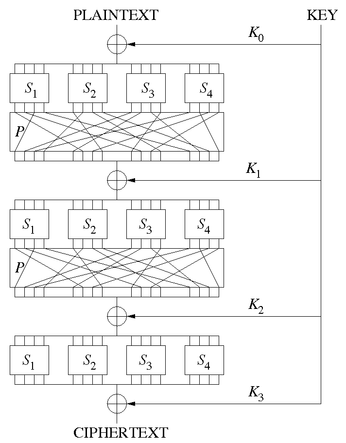

# SP-сеть

SP-сеть (Substitution-Permutation network, подстановочно-перестановочная сеть) — разновидность блочного шифра, предложенная в 1971 году Хорстом Фейстелем. В простейшем варианте представляет собой «сэндвич» из слоёв двух типов, используемых многократно по очереди. Первый тип слоя — P-слой, состоящий из P-блока большой разрядности, за ним идёт второй тип слоя — S-слой, представляющий собой большое количество S-блоков малой разрядности, потом опять P-слой и т. д. Первым криптографическим алгоритмом на основе SP-сети был «Люцифер» (1971). В настоящее время из алгоритмов на основе SP-сетей широко используется AES (Rijndael). Альтернативой SP-сетям являются сети [Фейстеля](Feistel.md).

В современных алгоритмах вместо S- и P-блоков используются различные математические или логические функции. Любая двоичная функция может быть сведена к S-блоку, некоторые функции — к P-блоку. Например, к P-блоку сводится циклический сдвиг, сам P-блок является частным случаем S-блока. Такие функции, как правило, легко реализуются в аппаратуре, обеспечивая при этом хорошую криптостойкость.

# Принцип работы

Пример SP-сети с 3 раундами

Шифр на основе SP-сети получает на вход блок и ключ и совершает несколько чередующихся раундов, состоящих из чередующихся стадий подстановки (англ. substitution stage) и стадий перестановки (англ. permutation stage).

Для достижения безопасности достаточно одного S-блока, но такой блок будет требовать большого объёма памяти. Поэтому используются маленькие S-блоки, смешанные с P-блоками.

Нелинейная стадия подстановки перемешивает биты ключа с битами открытого текста, создавая конфузию Шеннона. Линейная стадия перестановки распределяет избыточность по всей структуре данных, порождая диффузию.

S-блок (англ. substitution box or S-box) замещает маленький блок входных бит на другой блок выходных бит. Эта замена должна быть взаимно однозначной, чтобы гарантировать обратимость. Назначение S-блока заключается в нелинейном преобразовании, что препятствует проведению линейного криптоанализа. Одним из свойств S-блока является лавинный эффект, то есть изменение одного бита на входе приводит к изменению всех бит на выходе.

Пример S-блока (DES, преобразование 6 бит в 4 бита)

P-блок (англ. permutation box or P-box) — перестановка всех бит: блок получает на вход вывод S-блока, меняет местами все биты и подает результат S-блоку следующего раунда. Важным качеством P-блока является возможность распределить вывод одного S-блока между входами как можно больших S-блоков.

Пример P-блока

Для каждого раунда используется свой, получаемый из первоначального, ключ. Подобный ключ называется раундовым. Он может быть получен как делением первоначального ключа на равные части, так и каким-либо преобразованием всего ключа.

