# Режим шифрования

Режим шифрования — метод применения блочного шифра (алгоритма), позволяющий преобразовать последовательность блоков открытых данных в последовательность блоков зашифрованных данных. При этом для шифрования одного блока могут использоваться данные другого блока.

Обычно режимы шифрования используются для изменения процесса шифрования так, чтобы результат шифрования каждого блока был уникальным вне зависимости от шифруемых данных и не позволял сделать какие-либо выводы об их структуре. Это обусловлено, прежде всего, тем, что блочные шифры шифруют данные блоками фиксированного размера, и поэтому существует потенциальная возможность утечки информации о повторяющихся частях данных, шифруемых на одном и том же ключе.

# Режим простой замены

Electronic Codebook (ECB), Режим электронной кодовой книги, в ГОСТ 28147—89 этот режим называется режимом простой замены.

## Шифрование

Шифрование в режиме ECB (режиме электронной кодовой книги)

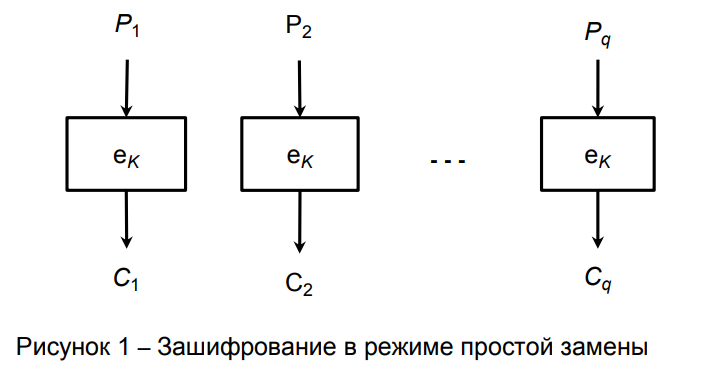

Пусть дано сообщение $P$ (открытый текст, последовательность бит, данные).

Во время шифрования выполняются следующие действия:

1. Сообщение делится на блоки одинакового размера. Размер (длина) блока равен n и измеряется в битах. В результате получается последовательность блоков  $ P_{1},P_{2},...,P_{q} $. Последний блок при необходимости дополняется до длины  $n$.

2. Каждый блок $ P_{i}$ шифруется алгоритмом шифрования $E_{k}$ с использованием ключа k:

$C_{i}=E_{k}\left(P_{i},k\right)$,
где:
    i — номер блока;
    k — ключ;
    $P_{i}$ — блок сообщения (открытый текст);
    $C_{i}$ — зашифрованный блок (шифротекст);
    $E_{k}$ — функция, выполняющая блочное шифрование.

В результате получаются зашифрованные блоки  $C_{1},C_{2},...,C_{q}$.

## Расшифровка:

выполняется функцией $D_{k}$ с использованием того же ключа k: 
$P_{i}=D_{k}\left(C_{i},k\right)$.

## Особенности:

- каждый блок шифруется/расшифровывается независимо от других блоков.

## Недостатки ECB:

- сохранение статистических особенностей открытого текста (поскольку одинаковым блокам шифротекста соответствуют одинаковые блоки открытого текста). 

Пример.
		
Открытый текст в виде изображения:

Криптограмма, полученная шифрованием в режиме ECB:

Криптограмма, полученная шифрованием в режиме, отличном от ECB: 

На изображении видны черты исходного изображения	. Изображение представляет собой псевдослучайную последовательность пикселей

## Достоинства ECB:

- постоянная скорость обработки блоков (скорость определяется эффективностью реализации шифра);
- возможно распараллеливание вычислений (так как блоки не связаны между собой).

Этот режим называется режимом электронной кодовой книги, так как существует возможность создать книгу, в которой каждому блоку открытого текста будет сопоставлен блок зашифрованного текста. Однако создать книгу — нетривиальная задача. Если размер блока равен `x` бит, то в книге будет содержаться `2x` записей, и каждая книга будет соответствовать одному ключу.

# Режим сцепления блоков шифротекста

Cipher Block Chaining (CBC), в ГОСТ 28147—89 этот режим называется режимом сцепления блоков шифротекста.

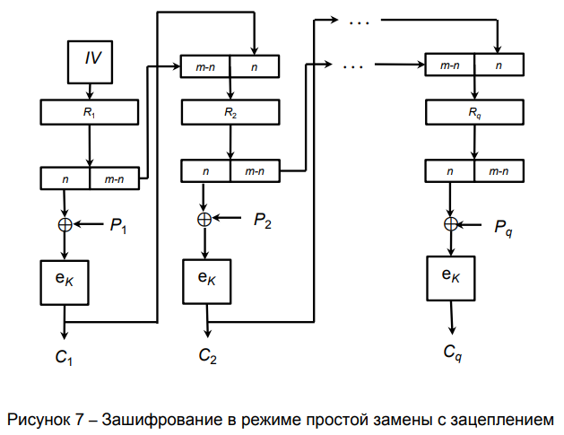

## Для шифрования некоторого сообщения $P$ выполняются следующие действия.

1. Сообщение разбивается на блоки одинакового размера. Размер (длина) блока равен n и измеряется в битах. При необходимости последний блок дополняется до длины $n$.

2. Шифрование очередного (i-го) блока сообщения $P_{i}$ выполняется с использованием предыдущего зашифрованного $(i-1)$-го блока $C_{i-1}$. Для первого блока $P_{1}$ зашифрованного блока $C_{0}$ не существует, поэтому первый блок шифруют с использованием «вектора инициализации» (англ. initialization vector, IV): $C_{0}=IV$ (вектор инициализации — случайное число). Размер (длина) $IV$ равна размеру блока $n$.

В функцию шифрования $E_{k}$ передаётся сумма по модулю 2 («⊕», «xor») текущего блока сообщения $P_{i}$ и предыдущего зашифрованного блока $C_{i-1}$:

$C_{i}=E_{k}\left(P_{i}\oplus C_{i-1},k\right)$,

где:
    i — номер блока;
    k — ключ;
    IV — вектор инициализации (синхропосылка);
    $P_{i}$ — блок сообщения (открытый текст);
    $C_{i-1}$ — зашифрованный блок (шифротекст), полученный на предыдущем шаге шифрования;
    $E_{k}$ — функция, выполняющая блочное шифрование.

## Расшифровка выполняется функцией 
$D_{k}$ с использованием тех же ключа k и вектора инициализации IV:

$C_{0}=IV$
$P_{i}=C_{i-1}\oplus D_{k}\left(C_{i},k\right)$

## Недостатки CBC:

- возможность определения начала изменения данных по изменению шифротекста (если сравнить шифротексты двух сообщений с одним и тем же ключом, то номер первого блока, в котором шифротексты различаются, будет соответствовать номеру первого блока, в котором различаются исходные сообщения);

- возможность изменения открытого текста при перемещении блоков; .

- возможность изменения блока шифротекста $C_{i-1}$ путём изменения блока сообщения $P_{i}$;

- невозможность распараллеливания шифрования (поскольку для шифрования каждого i-го блока требуется блок, зашифрованный на предыдущем шаге (блоки связаны между собой)).

## Достоинства CBC:

- постоянная скорость обработки блоков (скорость определяется эффективностью реализации шифра; время выполнения операции «xor» пренебрежимо мало);

- отсутствие статистических особенностей, характерных для режима ECB (поскольку каждый блок открытого текста «смешивается» с блоком шифротекста, полученным на предыдущем шаге шифрования);

- возможность распараллеливания расшифровки.

# Режима распространяющегося сцепления блоков шифра

Propagating Cipher Block Chaining (РСВС).

Недостатки режима CBC привели к созданию усовершенствованного режима распространяющегося сцепления блоков шифра (Propagating Cipher Block Chaining, РСВС). Естественно, этот режим похож на CBC за исключением того, что предыдущий блок открытого текста и предыдущий блок шифротекста подвергается операции XOR с текущим блоком открытого текста перед шифрованием или после него.
$c_{i}=E_{k}\left(m_{i}\oplus m_{i-1}\oplus c_{i-1}\right)$

Соответственно расшифрование: 
$m_{i}=D_{k}(c_{i})\oplus c_{i-1}\oplus m_{i-1}$
где 
$m_{0}\oplus c_{0}$ — вектор инициализации

Режим шифрования РСВС применяется в протоколе Kerberos 4 версии и позволяет обнаруживать ошибки. Данный режим шифрования не является федеральным или международным стандартом. Режим РСВС — вариант режима СВС, обладающий специфическим свойством — ошибка шифротекста приводит к неправильному дешифрированию всех последующих блоков. Это соответственно означает, что проверка стандартного блока в конце сообщения обеспечивает целостность всего сообщения.

Конечно, этот режим не лишён недостатков, так перестановка двух блоков шифротекста приводит к неправильной расшифровке двух соответствующих блоков открытого текста, но из-за XOR над открытым текстом и шифротекстом дальнейшие ошибки компенсируются. Поэтому, если при проверке целостности проверяются только несколько последних блоков расшифрованного текста, можно получить частично испорченное сообщение. Хотя никто ещё не воспользовался этой уязвимостью в Kerberos, но в 5 версии уже перешли на режим CBC.

# Режим обратной связи по шифротексту, режим гаммирования с обратной связью по выходу

Cipher Feedback (CFB), режим обратной связи по шифротексту, режим гаммирования с обратной связью (англ. cipher feed back mode, CFB). Во время шифрования каждый блок открытого текста складывается по модулю 2 с блоком, зашифрованным на предыдущем шаге.

$C_{0}=IV$,
$C_{i}=E_{k}\left(C_{i-1},k\right)\oplus P_{i}$,
$P_{i}=E_{k}\left(C_{i-1},k\right)\oplus C_{i}$.

Криптостойкость CFB определяется криптостойкостью используемого шифра. Блоки открытого текста «смешиваются» («маскируются») с блоками шифротекста. Если в режиме CFB с полноблочной обратной связью имеется два идентичных блока шифротекста, результат, например, шифрования алгоритмом DES на следующем шаге будет тем же. Скорость шифрования режима CFB с полноблочной обратной связью та же, что и у блочного шифра, причём возможности распараллеливания процедуры шифрования ограничены.

# Режим обратной связи по выходу

Output Feedback (OFB), режим обратной связи по выходу. Режим (OFB) обратной связи вывода превращает блочный шифр в синхронный шифр потока: он генерирует ключевые блоки, которые являются результатом сложения с блоками открытого текста, чтобы получить зашифрованный текст. Так же, как с другими шифрами потока, зеркальное отражение в зашифрованном тексте производит зеркально отражённый бит в открытом тексте в том же самом местоположении. Это свойство позволяет многим кодам с исправлением ошибок функционировать как обычно, даже когда исправление ошибок применено перед кодированием.

## Из-за симметрии операции сложения, шифрование и расшифрование похожи:

$C_{i}=P_{i}\oplus O_{i}$,
$P_{i}=C_{i}\oplus O_{i}$,
$O_{i}=E_{k}(O_{i-1}),
$O_{0}=IV$.

Шифрование в режиме OFB

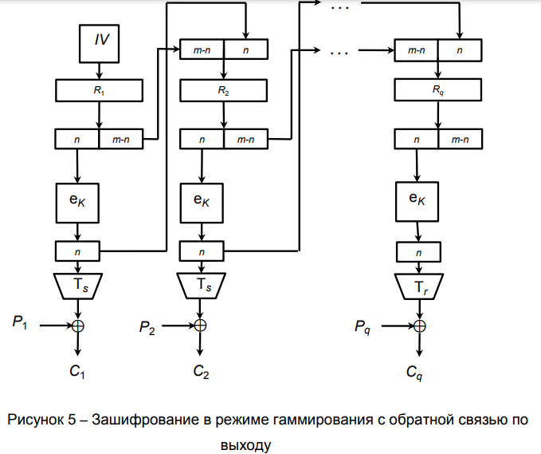

## Расшифрование в режиме OFB
Каждая операция блочного шифра обратной связи вывода зависит от всех предыдущих и поэтому не может быть выполнена параллельно. Однако, из-за того, что открытый текст или зашифрованный текст используются только для конечного сложения, операции блочного шифра могут быть выполнены заранее, позволяя выполнить заключительное шифрование параллельно с открытым текстом.

Обратная связь по выходу на `k` разрядов не рекомендуется из соображений криптостойкости. 

Режим OFB имеет следующее преимущество по сравнению с режимом CFB: 
- ошибки, возникающие в результате передачи по каналу с шумом, при дешифровании не «размазываются» по всему шифротексту, а локализуются в пределах одного блока. Однако открытый текст может быть изменён путём определённых манипуляций с блоками шифротекста. 
- несмотря на то, что OFB-шифрование не поддаётся распараллеливанию, эффективность процедуры может быть повышена за счёт предварительной генерации независимой последовательности блоков.

Данный метод называется также «режим обратной связи по выходу».

OFB также предполагает некое усовершенствование, касающееся метода генерации независимой последовательности блоков: для получения очередного блока предлагается шифровать не с  $O_{i}$, а c $O_{i}+IV(mod2^{64})$, где $IV$ некоторый вектор инициализации.

# Режим счётчика (гаммирования)

Counter mode (CTR), режим гаммирования, режим счётчика (counter mode, CTR) предполагает возврат на вход соответствующего алгоритма блочного шифрования значения некоторого счётчика, накопленного с момента старта. Режим делает из блочного шифра потоковый, то есть генерирует последовательность, к которой применяется операция XOR с текстом сообщения. Исходный текст и блок зашифрованного текста имеют один и тот же размер блока, как и основной шифр. Режим CTR предусматривает следующие операции.

## Шифрование в режиме CTR
$C_{i}=P_{i}\oplus E_{k}(Ctr_{i});i=1,2,\ldots ,m $

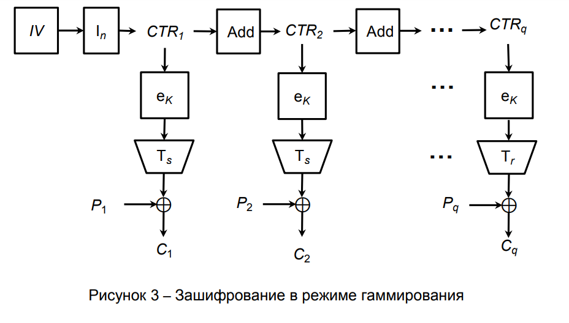

## Расшифровка в режиме CTR
$P_{i}=C_{i}\oplus E_{k}(Ctr_{i});i=1,2,\ldots ,m $

$Ctr_{i}$ — значение счётчика для i-го блока.

Значения счётчика должны быть уникальными для каждого блока открытого текста, кодируемого данным шифром при данном ключе (в противном случае блоки шифротекста, зашифрованные с помощью идентичных значений счётчика, оказываются под угрозой). Это требование удовлетворяется в два этапа.

1. Во-первых, значения счётчика для шифрования блоков в пределах одного сообщения получаются из начального значения счётчика использованием функции приращения. Чтобы обеспечивать случайность, величина приращения может зависеть от номера блока. Стандартная функция приращения может быть применена как ко всему блоку счётчика, так и к его части. Пусть значение счётчика представляет блок из b битов, а функцию приращения мы применяем к m младшим разрядам.

$L_{i+1}=L_{i}+1\mod 2^{m}$
$Ctr_{i+1}=M_{i}|L_{i+1}$
$|$ — функция конкатенации; 
$L_{i}$ — младшие $m$ битов; 
$M_{i}$ — старшие $b-m$ битов. 

Уникальность значений счётчика обеспечивается для всех блоков сообщения при условии, что $n\leq 2^{m}$. Где $n$ — количество блоков, на которое разбивается сообщение.

2. Во-вторых, начальные значения счётчика для каждого сообщения выбираются таким образом, чтобы обеспечить уникальность всех используемых значений счётчика. Этого можно достичь разными способами. Например, если сообщения шифруются последовательно, то в качестве начального значения счётчика для данного сообщения можно использовать результат применения функции приращения к последнему значению счётчика предыдущего сообщения. При этом если функция приращения использует m битов, общее количество блоков открытого текста не должно превышать $2^{m}$. Другой подход предлагает разбить двоичное представление счётчика на две части. Старшие разряды назначаются одноразовым номером сообщения, а к оставшимся будет применяться функция приращения.

При отсутствии обратной связи алгоритмы шифрования и расшифровки в режиме CTR могут выполняться параллельно. Более того, большие объёмы вычислений, связанные с шифрованием значений счётчика, могут быть выполнены заранее, до того, как открытый текст или шифротекст окажутся доступными. Это обеспечивает режиму CTR преимущество перед режимами CFB и OFB.

# Random Delta (RD)

Режим Random Delta используется для устранения предсказуемости изменения счётчика в режиме CTR. К примеру, это AES, и размер блока 16 байт. Берётся случайный Initialization Vector (например, с помощью RdRand). Его младшие 8 байт считаются случайной дельтой — Random Delta (RD):

Initial (Initialization Vector) шифруется и передаётся в начале сообщения. Блок 0 перед шифрованием XOR-ится с Initial. Для каждого последующего блока величина Initial увеличивается на Delta (в беззнаковом целочисленном представлении — uint128 += uint64):

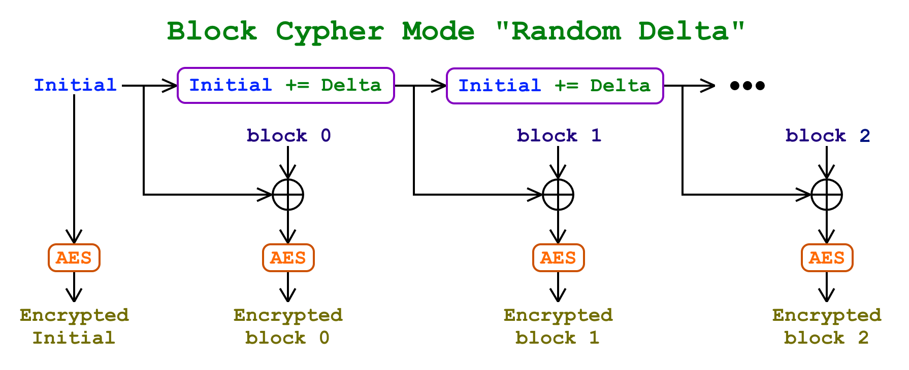

### Режим сцепления «Random Delta»
Таким образом устраняется предсказуемость изменения счётчика в режиме CTR. Если там дельта — всегда единица, здесь дельта — случайное число, одно из 2^64. Злоумышленнику оно, как и Initial, неизвестно.

Также, CTR настораживает непосредственным соседством открытого текста с шифротекстом через XOR. В Random Delta между открытым текстом и шифротекстом лежит AES.

Открытость передачи Initial также вызывает вопросы. Чем меньше атакующий видит — тем лучше. Чем более открытый текст отдалён от шифротекста — тем лучше. Все известные режимы — ECB, CBC, OFB, CTR — обладают какими-то из этих недостатков. В Random Delta всё лежит за AES'ом, а Initial и Delta — случайные величины, которые злоумышленнику неизвестны.

Впрочем, один из недостатков CTR в RD присутствует. Знание формата передаваемых данных позволяет вбрасывать в определённые места этих данных случайные искажения, что может быть использовано для атаки. Для проверки целостности в блочную последовательность может быть добавлен хэш:

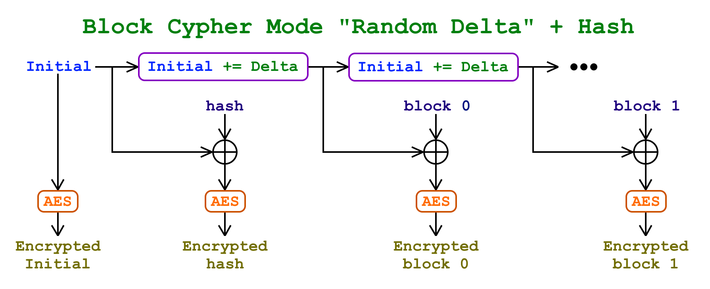

Random Delta + Hash
Похоже, что Random Delta + Hash указанных недостатков лишён. Передано в общественное достояние.

Важный момент: между закрытым текстом и открытым должно лежать множество пермутаций AES'а, иное ослабляет глубину шифрования. Закрытый текст как функция от открытого посредством одной лишь XOR сводит на нет глубину шифрования, которую даёт AES (а именно такой способ используют режимы OFB, CFB, CTR).

Криптостойкость Random Delta не намного ниже криптостойкости самого AES'а.

Если требуется более высокая степень случайности дельты (например, 128-битная), она может генерироваться отдельно и передаваться в начале сообщения вместе с Initial.

Как и CTR, Random Delta позволяет осуществлять шифрование/дешифрование блоков параллельно, с большей производительностью, не дожидаясь шифрования/дешифрования предыдущего блока (что является необходимостью в CBC, PCBC, CFB, OFB).

Режим "Random Delta 128" отличается использованием отдельных 128-битных Initial и Delta. Даёт бОльшую случайность тени.

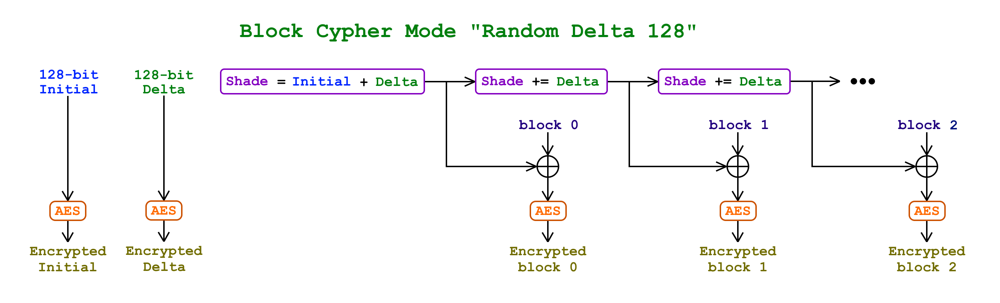

# Galois/Counter Mode (GCM) и AEAD

Galois/Counter Mode (счётчик с аутентификацией Галуа) — более безопасная модификация CTR, предоставляющее аутентифицированное шифрование с присоединёнными данными (AEAD-режим блочного шифрования).

В GCM используется функция Галуа «Mult» («GHASH(H, A, C)»), которая комбинирует блоки шифротекста и код аутентификации, чтобы получить тег аутентификации. На вход функции подается ключ хеширования H, являющийся результатом шифрования 128 нулевых битов на ключе K, т.е. $H=E(K, 0^128)$. Тег аутентификации используется для проверки целостности сообщения. По каналу передаются: вектор инициализации IV, блоки шифротекста, и код аутентификации (16 байтов). По своим свойствам режим GCM (GMAC) похож на HMAC.

# Операция дополнения сообщения

Прежде чем непосредственно рассмотреть режимы работы, необходимо познакомиться с одной весьма важной операцией — операцией дополнения сообщения, или паддинга (от английского Padding — набивка, заполнение).

Эта операция применяется при реализации режимов простой замены, простой замены с зацеплением и режима выработки имитовставки. Дело в том, что указанные режимы работают только с сообщениями, длина которых кратна размеру одного блока (напомню, 8 байт для «Магмы» и 16 байт для «Кузнечика»). Для сообщений, длина которых не кратна размеру блока, получающийся остаток необходимо дополнить до размера полного блока.

ГОСТ 34.13—2015 определяет три возможные процедуры дополнения.

## Процедура 1
Данная процедура применяется при работе в режиме простой замены или простой замены с зацеплением. Суть процедуры в том, что остаток в сообщении дополняется нулями до размера полного блока.

Схема дополнения в соответствии с процедурой 1

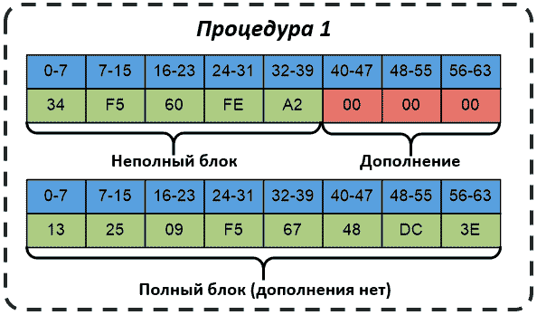

Использование этой процедуры не позволяет гарантировать однозначное восстановление исходного сообщения из расшифрованного, если неизвестна длина дополнения либо длина исходного сообщения.

Пример дополнения в соответствии с процедурой 1 (как видим, не зная длины исходного сообщения или длины дополнения, удалить верное количество ненужных нулей из расшифрованного сообщения для восстановления исходного просто так не получится)

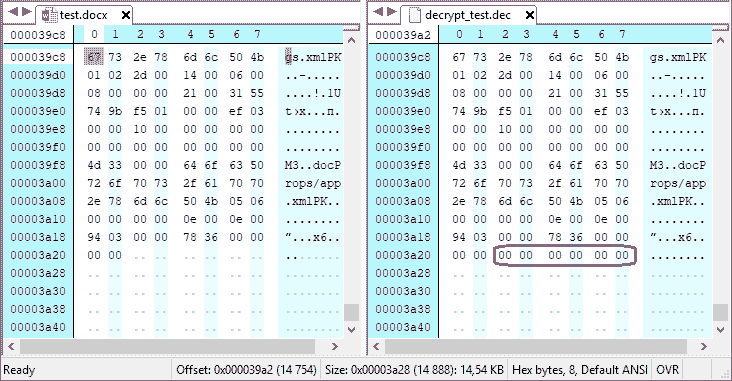

## Процедура 2

Особенность этого варианта процедуры дополнения заключается в том, что дополнение выполняется в любом случае, независимо от того, кратна длина сообщения размеру блока или нет. Это позволяет восстанавливать исходное сообщение из расшифрованного без знания дополнительной информации (длины исходного сообщения или длины дополнения).

Схема дополнения в соответствии с процедурой 2

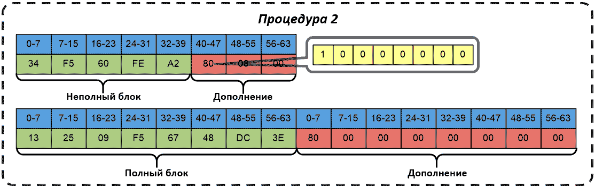

При реализации этой процедуры возможно два варианта: длина исходного сообщения не кратна размеру блока (то есть в конце сообщения имеется неполный блок) и длина исходного сообщения кратна размеру одного блока.

В первом случае в первый бит остатка пишется единица, а остальное место заполняется нулями до размера полного блока. Во втором к сообщению добавляется целый дополнительный блок, начинающийся с единичного бита, с заполнением остальных разрядов этого дополнительного блока нулями.

Такой вариант дополнения также рекомендован для использования в режиме простой замены или простой замены с зацеплением.

## Процедура 3
Эта процедура похожа на первую тем, как она выполняется, и на вторую содержимым этого дополнения. Если длина сообщения кратна размеру блока, то никаких дополнений делать не нужно, в противном случае остаток исходного сообщения дополняется до размера полного блока единичным начальным битом с последующим заполнением нулями.

Схема дополнения в соответствии с процедурой 3

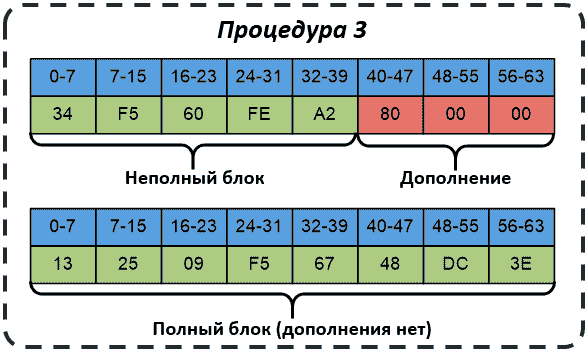

Процедуру, реализованную в таком варианте, рекомендуется использовать только для режима выработки имитовставки.