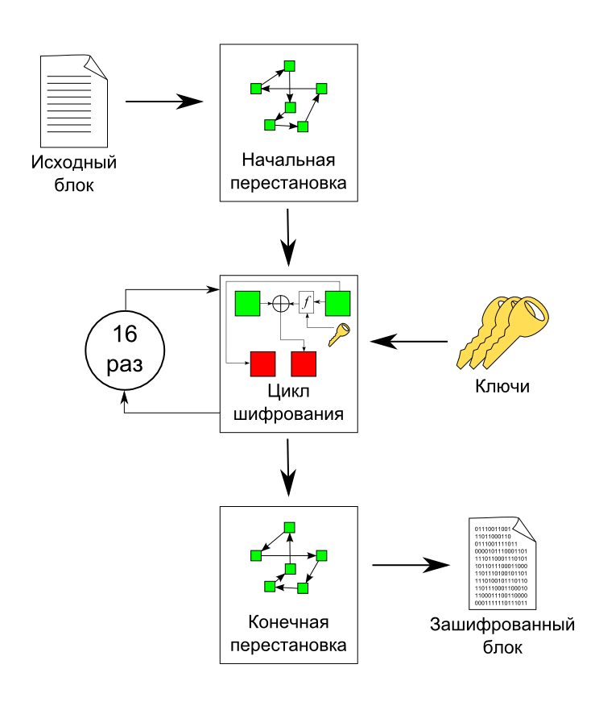
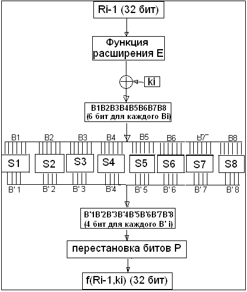
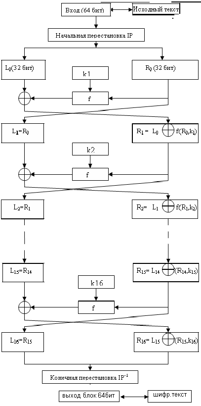

# DES

DES (англ. Data Encryption Standard) — алгоритм для симметричного шифрования, разработанный фирмой IBM и утверждённый правительством США в 1977 году как официальный стандарт (FIPS 46-3). Размер блока для DES равен 64 битам. В основе алгоритма лежит сеть Фейстеля с 16 циклами (раундами) и ключом, имеющим длину 56 бит. Алгоритм использует комбинацию нелинейных (S-блоки) и линейных (перестановки E, IP, IP-1) преобразований. Для DES рекомендовано несколько режимов:

- ECB (англ. electronic code book) — режим «электронной кодовой книги» (простая замена);
- CBC (англ. cipher block chaining) — режим сцепления блоков;
- CFB (англ. cipher feed back) — режим обратной связи по шифротексту;
- OFB (англ. output feed back) — режим обратной связи по выходу;
- Counter Mode (CM) — режим счётчика.

Прямым развитием DES в настоящее время является алгоритм Triple DES (3DES). В 3DES шифрование/расшифрование выполняются путём троекратного выполнения алгоритма DES.

Входными данными для блочного шифра служат:

- блок размером n бит;
- ключ размером k бит.

На выходе (после применения шифрующих преобразований) получается зашифрованный блок размером n бит, причём незначительные различия входных данных, как правило, приводят к существенному изменению результата.

Блочные шифры реализуются путём многократного применения к блокам исходного текста некоторых базовых преобразований.

Базовые преобразования:

- сложное преобразование на одной локальной части блока;
- простое преобразование между частями блока.

Так как преобразования производятся поблочно, требуется разделение исходных данных на блоки необходимого размера. При этом формат исходных данных не имеет значения (будь то текстовые документы, изображения или другие файлы). Данные должны интерпретироваться в двоичном виде (как последовательность нулей и единиц) и только после этого должны разбиваться на блоки. Все вышеперечисленное может осуществляться как программными, так и аппаратными средствами.

Алгоритм шифрования 

Исходный текст — блок 64 бит.

Процесс шифрования состоит из начальной перестановки, 16 циклов шифрования и конечной перестановки.



## Начальная перестановка
Исходный текст `T` (блок 64 бит) преобразуется c помощью начальной перестановки `IP` которая определяется таблицей:

```
58	50	42	34	26	18	10	2	60	52	44	36	28	20	12	4
62	54	46	38	30	22	14	6	64	56	48	40	32	24	16	8
57	49	41	33	25	17	9	1	59	51	43	35	27	19	11	3
61	53	45	37	29	21	13	5	63	55	47	39	31	23	15	7
```

По таблице первые 3 бита результирующего блока IP(T) после начальной перестановки IP являются битами 58, 50, 42 входного блока `T`, а его 3 последние бита являются битами 23, 15, 7 входного блока.

## Циклы шифрования
Полученный после начальной перестановки 64-битовый блок `IP(T)` участвует в 16 циклах преобразования Фейстеля.

— 16 циклов преобразования Фейстеля:

Разбить IP(T) на две части $L_{0},R_{0}$, где $L_{0},R_{0}$ — соответственно 32 старших битов и 32 младших битов блока 
$T_{0}$, $IP(T)=L_{0}R_{0}

Пусть 
$T_{i-1}=L_{i-1}R_{i-1}$ результат (i-1) итерации, тогда результат i-ой итерации 
$T_{i}=L_{i}R_{i}$ определяется:

$L_{i}=R_{i-1}$
$R_{i}=L_{i-1}\oplus f(R_{i-1},k_{i})$

Левая половина  $L_{i}$ равна правой половине предыдущего вектора $L_{i-1}R_{i-1}$. А правая половина $R_{i}$ — это битовое сложение $L_{i-1}$ и $f(R_{i-1},k_{i})$ по модулю 2.

В 16-циклах преобразования Фейстеля функция f играет роль шифрования. Рассмотрим подробно функцию f.

## Основная функция шифрования (функция Фейстеля)
Аргументами функции  $f$ являются 32-битовый вектор $R_{i-1}$ и 48-битовый ключ $k_{i}$, который является результатом преобразования 56-битового исходного ключа шифра k. Для вычисления функции $f$ последовательно используются 
- функция расширения  $E$, 
- сложение по модулю 2 с ключом $k_{i}$, 
- преобразование $S$, состоящее из 8 преобразований S-блоков $\mathrm {S} _{1},\mathrm {S} _{2},\mathrm {S} _{3}\ldots \ \mathrm {S} _{8}$, 
- перестановка $P$.



Функция $E$ расширяет 32-битовый вектор $R_{i-1}$ до 48-битового вектора ${E} (R_{i-1})$ путём дублирования некоторых битов из $R_{i-1}$; порядок битов вектора ${E} (R_{i-1})$ указан в таблице.

```
32	1	2	3	4	5
4	5	6	7	8	9
8	9	10	11	12	13
12	13	14	15	16	17
16	17	18	19	20	21
20	21	22	23	24	25
24	25	26	27	28	29
28	29	30	31	32	1
```

По таблице видно, что биты `1, 4, 5, 8, 9, 12, 13, 16, 17, 20, 21, 24, 25, 28, 29, 32` дублируются. 

Полученный после перестановки блок $ \mathrm {E} (R_{i-1})$ складывается по модулю 2 с ключами $ k_{i}$ и затем представляется в виде восьми последовательных блоков $ B_{1},B_{2},...B_{8}$.

$ \mathrm {E} (R_{i-1})\oplus k_{i}=B_{1}B_{2}...B_{8}$

Каждый $ B_{j}$ является 6-битовым блоком. Далее каждый из блоков $B_{j}$ трансформируется в 4-битовый блок $ B'_{j}$ с помощью преобразований $S_{j}$. Преобразования $S_{j}$ определяются таблицей

```
	0	1	2	3	4	5	6	7	8	9	10	11	12	13	14	15	
0	14	4	13	1	2	15	11	8	3	10	6	12	5	9	0	7	
1	0	15	7	4	14	2	13	1	10	6	12	11	9	5	3	8	S1
2	4	1	14	8	13	6	2	11	15	12	9	7	3	10	5	0	
3	15	12	8	2	4	9	1	7	5	11	3	14	10	0	6	13	

0	15	1	8	14	6	11	3	4	9	7	2	13	12	0	5	10	
1	3	13	4	7	15	2	8	14	12	0	1	10	6	9	11	5	S2
2	0	14	7	11	10	4	13	1	5	8	12	6	9	3	2	15	
3	13	8	10	1	3	15	4	2	11	6	7	12	0	5	14	9	

0	10	0	9	14	6	3	15	5	1	13	12	7	11	4	2	8	
1	13	7	0	9	3	4	6	10	2	8	5	14	12	11	15	1	S3
2	13	6	4	9	8	15	3	0	11	1	2	12	5	10	14	7	
3	1	10	13	0	6	9	8	7	4	15	14	3	11	5	2	12	

0	7	13	14	3	0	6	9	10	1	2	8	5	11	12	4	15	
1	13	8	11	5	6	15	0	3	4	7	2	12	1	10	14	9	S4
2	10	6	9	0	12	11	7	13	15	1	3	14	5	2	8	4	
3	3	15	0	6	10	1	13	8	9	4	5	11	12	7	2	14	

0	2	12	4	1	7	10	11	6	8	5	3	15	13	0	14	9	
1	14	11	2	12	4	7	13	1	5	0	15	10	3	9	8	6	S5
2	4	2	1	11	10	13	7	8	15	9	12	5	6	3	0	14	
3	11	8	12	7	1	14	2	13	6	15	0	9	10	4	5	3	

0	12	1	10	15	9	2	6	8	0	13	3	4	14	7	5	11	
1	10	15	4	2	7	12	9	5	6	1	13	14	0	11	3	8	S6
2	9	14	15	5	2	8	12	3	7	0	4	10	1	13	11	6	
3	4	3	2	12	9	5	15	10	11	14	1	7	6	0	8	13	

0	4	11	2	14	15	0	8	13	3	12	9	7	5	10	6	1	
1	13	0	11	7	4	9	1	10	14	3	5	12	2	15	8	6	S7
2	1	4	11	13	12	3	7	14	10	15	6	8	0	5	9	2	
3	6	11	13	8	1	4	10	7	9	5	0	15	14	2	3	12	

0	13	2	8	4	6	15	11	1	10	9	3	14	5	0	12	7	
1	1	15	13	8	10	3	7	4	12	5	6	11	0	14	9	2	S8
2	7	11	4	1	9	12	14	2	0	6	10	13	15	3	5	8	
3	2	1	14	7	4	10	8	13	15	12	9	0	3	5	6	11	

```

Значение функции $f(R_{i-1},k_{i})$ (32 бит) получается перестановкой Р, применяемой к 32-битовому блоку $ B'_{1}B'_{2}...B'_{8}$. Перестановка Р задана таблицей

```
16	7	20	21	29	12	28	17
1	15	23	26	5	18	31	10
2	8	24	14	32	27	3	9
19	13	30	6	22	11	4	25
```



Ключи $ k_{i}$ получаются из начального ключа `k` (56 бит = 7 байтов или 7 символов в ASCII) следующим образом. Добавляются биты в позиции 8, 16, 24, 32, 40, 48, 56, 64 ключа `k` таким образом, чтобы каждый байт содержал нечетное число единиц. Это используется для обнаружения ошибок при обмене и хранении ключей. Затем делают перестановку для расширенного ключа (кроме добавляемых битов 8, 16, 24, 32, 40, 48, 56, 64). Такая перестановка определена в таблице

```
57	49	41	33	25	17	9	1	58	50	42	34	26	18	C0
10	2	59	51	43	35	27	19	11	3	60	52	44	36	
63	55	47	39	31	23	15	7	62	54	46	38	30	22	D0
14	6	61	53	45	37	29	21	13	5	28	20	12	4	
```

Эта перестановка определяется двумя блоками $C_{0}$ и $D_{0}$ по 28 бит каждый. Первые 3 бита $C_{0}$ есть биты 57, 49, 41 расширенного ключа. А первые три бита $D_{0}$ есть биты 63, 55, 47 расширенного ключа. 

$C_{i},D_{i}, i=1,2,3…$ получаются из  $ C_{i-1},D_{i-1}$ одним или двумя левыми циклическими сдвигами согласно таблице.

```
i	            1	2	3	4	5	6	7	8	9	10	11	12	13	14	15	16
Число сдвига	1	1	2	2	2	2	2	2	1	2	2	2	2	2	2	1
```

Ключ $k_{i}, i=1,…16$ состоит из 48 бит, выбранных из битов вектора $C_{i}D_{i}$ (56 бит) согласно таблице. Первый и второй биты $k_{i}$ есть биты 14, 17 вектора $C_{i}D_{i}$.

```
14	17	11	24	1	5	3	28	15	6	21	10	23	19	12	4
26	8	16	7	27	20	13	2	41	52	31	37	47	55	30	40
51	45	33	48	44	49	39	56	34	53	46	42	50	36	29	32
```

## Конечная перестановка

Конечная перестановка $ {IP} ^{-1}$ действует на $T_{16}^{-1}$ (где $T_{16}^{-1}=R_{16}+L_{16}$) и является обратной к первоначальной перестановке. Конечная перестановка определяется таблицей.

```
40	8	48	16	56	24	64	32	39	7	47	15	55	23	63	31
38	6	46	14	54	22	62	30	37	5	45	13	53	21	61	29
36	4	44	12	52	20	60	28	35	3	43	11	51	19	59	27
34	2	42	10	50	18	58	26	33	1	41	9	49	17	57	25
```


