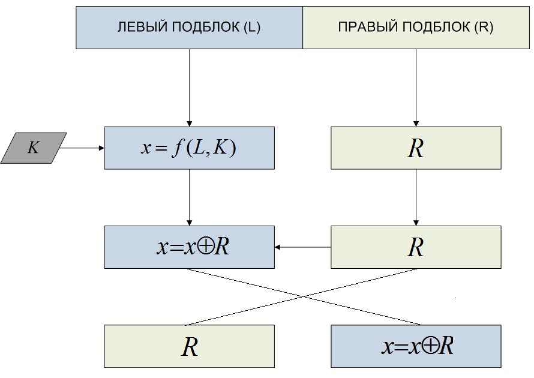

# Сеть Фейстеля

Сеть Фейстеля —это метод блочного шифрования, разработанный Хорстом Фейстелем в лаборатории IBM в 1971 году. Сегодня сеть Фейстеля лежит в основе большого количества криптографических протоколов.

Ряд блочных шифров (Магма, Кузнечик, DES, RC2, RC5, RC6, Blowfish, FEAL, CAST-128, TEA, XTEA, XXTEA и др.) использует сеть Фейстеля в качестве основы. Альтернативой сети Фейстеля является подстановочно-перестановочная сеть (Кузнечик, AES и др.) [SP-сеть](SP.md).

Сеть Фейстеля оперирует блоками открытого текста:

Блок разбивается на две равные части — левую `L` и правую `R`.
Левый подблок `L` изменяется функцией `f` с использованием ключа `K: X = f (L, K)`. В качестве функции может быть любое преобразование.

Полученный подблок `X` складывается по модулю 2 с правым подблоком `R`, который остался без изменений: `X = X + R`.
Полученные части меняются местами и склеиваются.

Эта последовательность действий называется ячейкой Фейстеля.

Сеть Фейстеля состоит из нескольких ячеек. Полученные на выходе первой ячейки подблоки поступают на вход второй ячейки, результирующие подблоки из второй ячейки попадают на вход третьей ячейки и так далее.

1. Первое, что нам нужно усвоить — это то, что XOR (обозначается ⊕) — инволютивная операция. Это всего лишь означает, что если поксорить одно число с другим дважды, то мы опять искомое получим. Т.е. 

$A ⊕ B ⊕ B == A$.

Отсюда следует, что можно выстраивать бесконечные цепочки $A ⊕ B ⊕ C ⊕ D ⊕…$ и если мы перексорим всё в обратном порядке, то получим A.

Например, 

$((100 ⊕ 200) ⊕ 50) ⊕ 150= 8. Отсюда 8 ⊕ 150 ⊕ 50 ⊕ 200 = 100$

2. Второй важный момент — в один момент времени изменяется лишь одна половинка блока

3. Теперь про «черный ящик» или функцию `F`. Функция `F` по идее может быть любой выдуманной функцией (хоть сложным хэшем, хоть тупо возвращающей 0), потому что когда мы будем в обратном порядке всё перексоривать(расшифровывать), то вторым аргументом у нас всегда будет тот же результат этой функции, что был в процессе шифрования. На практике же её создание сродни искусству и не дает 100% гарантии от новых методов криптоанализа.

Процесс шифрования и расшифроования:

