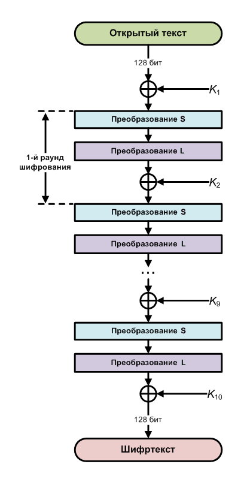
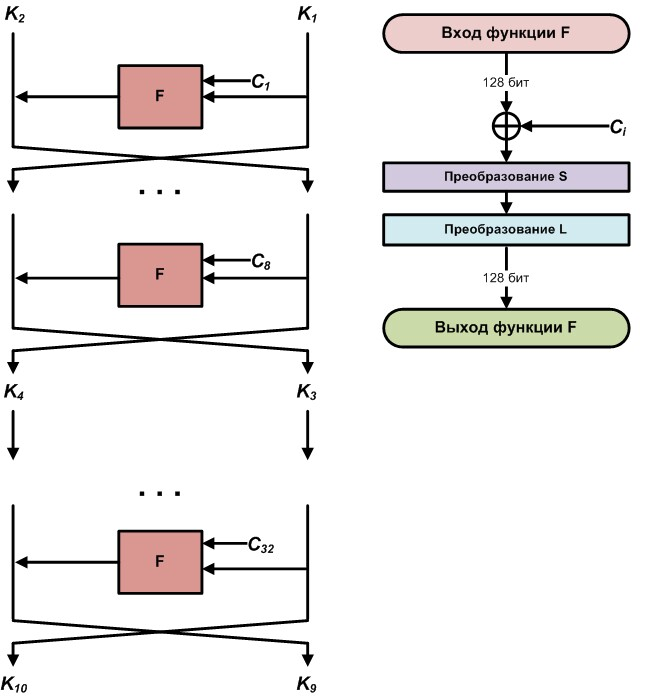
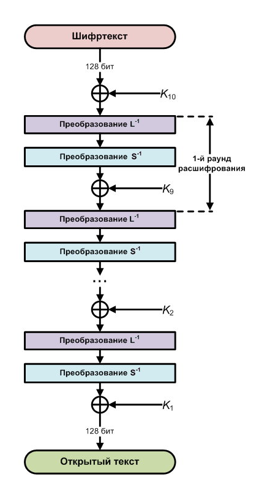
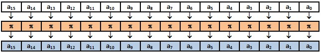
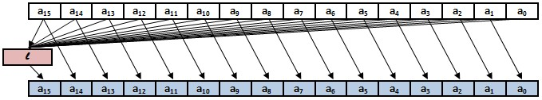

# Шифрование Кузнечик

Данный шифр утверждён (наряду с блочным шифром «Магма») в качестве стандарта в ГОСТ Р 34.12-2015 «Информационная технология. Криптографическая защита информации. Блочные шифры» приказом от 19 июня 2015 года № 749-ст. Стандарт вступил в действие с 1 января 2016 года. Шифр разработан Центром защиты информации и специальной связи ФСБ России с участием АО «Информационные технологии и коммуникационные системы» (АО «ИнфоТеКС»). Внесён Техническим комитетом по стандартизации ТК 26 «Криптографическая защита информации».

Протоколом № 54 от 29 ноября 2018 года, на основе ГОСТ Р 34.12-2015, Межгосударственным советом по метрологии, стандартизации и сертификации был принят межгосударственный стандарт ГОСТ 34.12-2018. Приказом Федерального агентства по техническому регулированию и метрологии от 4 декабря 2018 года № 1061-ст стандарт ГОСТ 34.12-2018 введен в действие в качестве национального стандарта Российской Федерации с 1 июня 2019 года.

Алгоритм «Кузнечик» более современный и теоретически более стойкий, чем алгоритм «Магма» (который, по сути, практически без изменений был взят из старого ГОСТ 28147—89), и поэтому сегодня мы рассмотрим именно его. Что касается «Магмы», то о нем — как-нибудь в другой раз в следующей статье цикла.

Как уже было сказано, длина шифруемого блока в алгоритме «Кузнечик» — 128 бит. Длина ключа шифрования — 256 бит.

!!! При чтении ГОСТа учти, что во всех 16-байтовых массивах тестовых последовательностей нулевой байт находится в конце массива, а пятнадцатый, соответственно, в начале.

!!! Одна из главных легенд российской криптографии гласит, что название алгоритма «Кузнечик» никакого отношения к зеленому насекомому не имеет, а представляет собой сокращение от фамилий создателей алгоритма — Кузнецова и Нечаева.

## Немного теории о шифровании Кузнечик

Основу алгоритма составляет не сеть Фейстеля, как в большинстве блочных шифров, а так называемая **SP** — Substitution-Permutation network, или, по-русски, подстановочно-перестановочная сеть. Шифр на основе **SP**-сети получает на вход блок и ключ и совершает несколько чередующихся раундов, состоящих из стадий подстановки и стадий перестановки. В «Кузнечике» каждый раунд включает в себя линейное и нелинейное преобразование плюс операцию наложения так называемого итерационного ключа. Всего таких раундов девять и один последний неполный раунд, в котором выполняется только наложение последнего (десятого) итерационного ключа.



Итерационные (или раундовые) ключи получаются путем определенных преобразований на основе мастер-ключа, длина которого, как мы уже знаем, составляет 256 бит. Этот процесс начинается с разбиения мастер-ключа пополам, так получается первая пара раундовых ключей. Для генерации каждой последующей пары раундовых ключей применяется восемь итераций сети Фейстеля, в каждой итерации используется константа, которая вычисляется путем применения линейного преобразования алгоритма к значению номера итерации.



Для расшифровывания используется такая же последовательность итераций, как и при зашифровывании, но порядок следования ключей изменяется на обратный.



## Базовые функции стандарта

Поскольку в алгоритме используются 128-битные блоки (в виде так называемых двоичных векторов), для начала определим этот самый блок:

```cpp
#define BLOCK_SIZE 16 // Размер блока 16 байт (или 128 бит)
...
typedef uint8_t vect[BLOCK_SIZE]; // Определяем тип vect как 16-байтовый массив
```

## Сложение двух двоичных векторов по модулю 2

Данная функция в стандарте определена как X-преобразование. Каждый байт первого вектора ксорится с соответствующим байтом второго вектора, и результат пишется в третий (выходной) вектор:

```cpp
static void GOST_Kuz_X(const uint8_t *a, const uint8_t *b, uint8_t *c)
{
    int i;
    for (i = 0; i < BLOCK_SIZE; i++)
        c[i] = a[i] ^ b[i];
}
```

## Нелинейное биективное преобразование (преобразование S)

Это преобразование в нашем случае повторяет S-преобразование из алгоритма «Стрибог» ГОСТ 34.11—2012. Массив S-преобразований тоже аналогичен ГОСТ 34.11—2012:

``` cpp
static const unsigned char Pi[256] = {
    0xFC, 0xEE, 0xDD, ... 0x63, 0xB6
};
```

Здесь для экономии места показаны не все значения, определенные в стандарте, а только три первых и два последних.

Код самой функции преобразования S получается такой:

```cpp
static void GOST_Kuz_S(const uint8_t *in_data, uint8_t *out_data)
{
    int i;
    for (i = 0; i < BLOCK_SIZE; i++)
        out_data[i] = Pi[in_data[i]];
}
```



## Обратное нелинейное биективное преобразование (обратное преобразование S)

Поскольку нам нужно не только зашифровывать сообщения, но и расшифровывать тоже, то каждому преобразованию зашифрования необходимо ставить в соответствие обратное преобразование для расшифрования. Сама функция обратного S-преобразования выглядит практически так же, как и прямое S-преобразование:

```cpp
static void GOST_Kuz_reverse_S(const uint8_t *in_data, uint8_t *out_data)
{
    int i;
    for (i = 0; i < BLOCK_SIZE; i++)
           out_data[i] = reverse_Pi[in_data[i]];
}
```

Отличие только в массиве преобразования, обратном к массиву прямого преобразования (в стандарте этот массив не приводится, поэтому напишем здесь его полностью):

```cpp
static const unsigned char reverse_Pi[256] = {
    0xA5, 0x2D, 0x32, 0x8F, 0x0E, 0x30, 0x38, 0xC0,
    0x54, 0xE6, 0x9E, 0x39, 0x55, 0x7E, 0x52, 0x91,
    0x64, 0x03, 0x57, 0x5A, 0x1C, 0x60, 0x07, 0x18,
    0x21, 0x72, 0xA8, 0xD1, 0x29, 0xC6, 0xA4, 0x3F,
    0xE0, 0x27, 0x8D, 0x0C, 0x82, 0xEA, 0xAE, 0xB4,
    0x9A, 0x63, 0x49, 0xE5, 0x42, 0xE4, 0x15, 0xB7,
    0xC8, 0x06, 0x70, 0x9D, 0x41, 0x75, 0x19, 0xC9,
    0xAA, 0xFC, 0x4D, 0xBF, 0x2A, 0x73, 0x84, 0xD5,
    0xC3, 0xAF, 0x2B, 0x86, 0xA7, 0xB1, 0xB2, 0x5B,
    0x46, 0xD3, 0x9F, 0xFD, 0xD4, 0x0F, 0x9C, 0x2F,
    0x9B, 0x43, 0xEF, 0xD9, 0x79, 0xB6, 0x53, 0x7F,
    0xC1, 0xF0, 0x23, 0xE7, 0x25, 0x5E, 0xB5, 0x1E,
    0xA2, 0xDF, 0xA6, 0xFE, 0xAC, 0x22, 0xF9, 0xE2,
    0x4A, 0xBC, 0x35, 0xCA, 0xEE, 0x78, 0x05, 0x6B,
    0x51, 0xE1, 0x59, 0xA3, 0xF2, 0x71, 0x56, 0x11,
    0x6A, 0x89, 0x94, 0x65, 0x8C, 0xBB, 0x77, 0x3C,
    0x7B, 0x28, 0xAB, 0xD2, 0x31, 0xDE, 0xC4, 0x5F,
    0xCC, 0xCF, 0x76, 0x2C, 0xB8, 0xD8, 0x2E, 0x36,
    0xDB, 0x69, 0xB3, 0x14, 0x95, 0xBE, 0x62, 0xA1,
    0x3B, 0x16, 0x66, 0xE9, 0x5C, 0x6C, 0x6D, 0xAD,
    0x37, 0x61, 0x4B, 0xB9, 0xE3, 0xBA, 0xF1, 0xA0,
    0x85, 0x83, 0xDA, 0x47, 0xC5, 0xB0, 0x33, 0xFA,
    0x96, 0x6F, 0x6E, 0xC2, 0xF6, 0x50, 0xFF, 0x5D,
    0xA9, 0x8E, 0x17, 0x1B, 0x97, 0x7D, 0xEC, 0x58,
    0xF7, 0x1F, 0xFB, 0x7C, 0x09, 0x0D, 0x7A, 0x67,
    0x45, 0x87, 0xDC, 0xE8, 0x4F, 0x1D, 0x4E, 0x04,
    0xEB, 0xF8, 0xF3, 0x3E, 0x3D, 0xBD, 0x8A, 0x88,
    0xDD, 0xCD, 0x0B, 0x13, 0x98, 0x02, 0x93, 0x80,
    0x90, 0xD0, 0x24, 0x34, 0xCB, 0xED, 0xF4, 0xCE,
    0x99, 0x10, 0x44, 0x40, 0x92, 0x3A, 0x01, 0x26,
    0x12, 0x1A, 0x48, 0x68, 0xF5, 0x81, 0x8B, 0xC7,
    0xD6, 0x20, 0x0A, 0x08, 0x00, 0x4C, 0xD7, 0x74
};
```

## Линейное преобразование (преобразование L)

Для выполнения данного преобразования необходима функция умножения чисел в конечном поле (или поле Галуа) над неприводимым полиномом $x^8 + x^7 + x^6 + x + 1$. Реализуется это следующим образом:

```cpp
static uint8_t GOST_Kuz_GF_mul(uint8_t a, uint8_t b)
{
    uint8_t c = 0;
    uint8_t hi_bit;
    int i;
    for (i = 0; i < 8; i++)
    {
        if (b & 1)
            c ^= a;
        hi_bit = a & 0x80;
        a <<= 1;
        if (hi_bit)
            a ^= 0xc3; // Полином x^8 + x^7 + x^6 + x + 1
        b >>= 1;
    }
    return c;
}
```

В целом, если внимательно посмотреть на код, можно увидеть, что это по большому счету умножение в столбик с добавлением числа 0xс3, которое и представляет нужный нам полином.

[Поля Галуа](Galua.md)

Далее, используя приведенную выше функцию, реализуем преобразование R, которое является частью линейного преобразования L. Преобразование R выполняется с использованием линейного регистра сдвига с обратной связью. Каждый байт из блока умножается с помощью функции `GOST_Kuz_GF_Mul` на один из коэффициентов из ряда `(148, 32, 133, 16, 194, 192, 1, 251, 1, 192, 194, 16, 133, 32, 148, 1)` в зависимости от порядкового номера байта. Байты складываются между собой по модулю 2, и все 16 байт блока сдвигаются в сторону младшего разряда, а полученное число записывается на место считанного байта.



Для реализации R-преобразования сначала определим массив нужных нам коэффициентов:

```cpp
static const unsigned char l_vec[16] = {
    1, 148, 32, 133, 16, 194, 192, 1,
    251, 1, 192, 194, 16, 133, 32, 148
};
```

Далее пишем саму функцию R-преобразования:

```cpp
static void GOST_Kuz_R(uint8_t *state)
{
    int i;
    uint8_t a_15 = 0;
    vect internal;
    for (i = 15; i >= 0; i--)
    {
        if (i == 0)
            internal[15] = state[i];
        else
            internal[i - 1] = state[i];// Двигаем байты в сторону младшего разряда
        a_15 ^= GOST_Kuz_GF_mul(state[i], l_vec[i]);
    }
    // Пишем в последний байт результат сложения
    internal[15] = a_15;
    memcpy(state, internal, BLOCK_SIZE);
}
```

Линейное преобразование L образуется сдвигом регистра 16 раз, или шестнадцатикратным повторением функции `GOST_Kuz_R`:

```cpp
static void GOST_Kuz_L(const uint8_t *in_data, uint8_t *out_data)
{
    int i;
    vect internal;
    memcpy(internal, in_data, BLOCK_SIZE);
    for (i = 0; i < 16; i++)
        GOST_Kuz_R(internal);
    memcpy(out_data, internal, BLOCK_SIZE);
}
```

## Обратное линейное преобразование (обратное преобразование L)

Для того чтобы можно было не только зашифровывать сообщения, но и расшифровывать их, нам необходимо обратное линейное преобразование.

Это запишется следующим образом:

```cpp
static void GOST_Kuz_reverse_L(const uint8_t *in_data, uint8_t *out_data)
{
    int i;
    vect internal;
    memcpy(internal, in_data, BLOCK_SIZE);
    for (i = 0; i < 16; i++)
        GOST_Kuz_reverse_R(internal);
    memcpy(out_data, internal, BLOCK_SIZE);
}
```

Функция `GOST_Kuz_reverse_R` — это не что иное, как обратное преобразование R. Выглядит это таким образом:

```cpp
static void GOST_Kuz_reverse_R(uint8_t *state)
{
    int i;
    uint8_t a_0;
    a_0 = state[15];
    vect internal;
    for (i = 0; i < 16; i++)
    {
        internal[i] = state[i - 1];// Двигаем все на старые места
        a_0 ^= GOST_Kuz_GF_mul(internal[i], l_vec[i]);
    }
    internal[0] = a_0;
    memcpy(state, internal, BLOCK_SIZE);
}
```
 
## Развертывание ключей

В начале мы уже говорили, что для зашифрования и расшифрования нам нужны десять итерационных ключей, а для их получения необходимы 32 итерационные константы, которые получаются из порядкового номера итерации с помощью L-преобразования.

Для начала определим место для хранения этих итерационных констант:

```cpp
vect iter_C[32];// Итерационные константы C
Далее вычислим их:

vect iter_num[32];// Сюда будем писать номер итерации от 1 до 32
for (i = 0; i < 32; i++)
{
    memset(iter_num[i], 0, BLOCK_SIZE);
    iter_num[i][0] = i+1;
}
// Делаем преобразование L для каждого элемента массива iter_num
for (i = 0; i < 32; i++)
     GOST_Kuz_L(iter_num[i], iter_C[i]);
```

Конечно, все это можно (и нужно, если ты хочешь, чтобы все работало немного быстрее) вычислить заранее и определить в тексте программы в виде констант. Мы же, чтобы соблюсти наглядность, пишем так, как показано в первоисточнике.

Далее определим функцию `F`, которая будет представлять одну итерацию развертывания ключа:

```cpp
static void GOST_Kuz_F(const uint8_t *in_key_1, const uint8_t *in_key_2,
                        uint8_t *out_key_1, uint8_t *out_key_2,
                        uint8_t *iter_const)
{
    vect internal;
    memcpy(out_key_2, in_key_1, BLOCK_SIZE);
    GOST_Kuz_X(in_key_1, iter_const, internal);
    GOST_Kuz_S(internal, internal);
    GOST_Kuz_L(internal, internal);
    GOST_Kuz_X(internal, in_key_2, out_key_1);
}
```

На вход функции подаем очередную пару ключей, очередную итерационную константу, на выходе получаем промежуточную пару итерационных ключей.

Для того чтобы получить нужные нам десять итерационных (раундовых) ключей, нужно прокрутить функцию `GOST_Kuz_F` 32 раза. Но для начала определим место, где будут храниться полученные значения ключей:

```cpp
vect iter_key[10]; // Итерационные ключи шифрования
```

После чего можно заняться непосредственным развертыванием ключей:

```cpp
void GOST_Kuz_Expand_Key(const uint8_t *key_1, const uint8_t *key_2)
{
    int i;

    // Предыдущая пара ключей
    uint8_t iter_1[64];
    uint8_t iter_2[64];

    // Текущая пара ключей
    uint8_t iter_3[64];
    uint8_t iter_4[64];
    GOST_Kuz_Get_C(); // Вычисляем итерационные константы

    // Первые два итерационных ключа равны паре мастер-ключа
    memcpy(iter_key[0], key_1, 64);
    memcpy(iter_key[1], key_2, 64);
    memcpy(iter_1, key_1, 64);
    memcpy(iter_2, key_2, 64);

    for (i = 0; i < 4; i++)
    {
        GOST_Kuz_F(iter_1, iter_2, iter_3, iter_4, iter_C[0 + 8 * i]);
        GOST_Kuz_F(iter_3, iter_4, iter_1, iter_2, iter_C[1 + 8 * i]);
        GOST_Kuz_F(iter_1, iter_2, iter_3, iter_4, iter_C[2 + 8 * i]);
        GOST_Kuz_F(iter_3, iter_4, iter_1, iter_2, iter_C[3 + 8 * i]);
        GOST_Kuz_F(iter_1, iter_2, iter_3, iter_4, iter_C[4 + 8 * i]);
        GOST_Kuz_F(iter_3, iter_4, iter_1, iter_2, iter_C[5 + 8 * i]);
        GOST_Kuz_F(iter_1, iter_2, iter_3, iter_4, iter_C[6 + 8 * i]);
        GOST_Kuz_F(iter_3, iter_4, iter_1, iter_2, iter_C[7 + 8 * i]);
        memcpy(iter_key[2 * i + 2], iter_1, 64);
        memcpy(iter_key[2 * i + 3], iter_2, 64);
    }
}
```

Результат работы `GOST_Kuz_Expand_Key` с мастер-ключом из примеров, приведенных в стандарте:

```
7766554433221100ffeeddccbbaa9988
efcdab89674523011032547698badcfe
448cc78cef6a8d2243436915534831db
04fd9f0ac4adeb1568eccfe9d853453d
acf129f44692e5d3285e4ac468646457
1b58da3428e832b532645c16359407bd
b198005a26275770de45877e7540e651
84f98622a2912ad73edd9f7b0125795a
17e5b6cd732ff3a52331c77853e244bb
43404a8ea8ba5d755bf4bc1674dde972
```

## Зашифровываем

Как мы уже говорили, шифрование производится путем девяти итераций, включающих в себя преобразование X (сложение по модулю 2 исходного сообщения с очередным итерационным ключом), преобразование S и преобразование L, а также неполной десятой итерации, состоящей из преобразования X (сложение по модулю 2 с последним итерационным ключом):

```cpp
void GOST_Kuz_Encript(const uint8_t *blk, uint8_t *out_blk)
{
    int i;
    memcpy(out_blk, blk, BLOCK_SIZE);

    for(i = 0; i < 9; i++)
    {
        GOST_Kuz_X(iter_key[i], out_blk, out_blk);
        GOST_Kuz_S(out_blk, out_blk);
        GOST_Kuz_L(out_blk, out_blk);
    }
    GOST_Kuz_X(out_blk, iter_key[9], out_blk);
}
```

Перед запуском данной функции не забудь вызвать `GOST_Kuz_Expand_Key`, чтобы заполнить массив с итерационными ключами нужными значениями.

 
## Расшифровываем

Расшифрование производится в обратном порядке и с использованием обратных преобразований:

```cpp
void GOST_Kuz_Decript(const uint8_t *blk, uint8_t *out_blk)
{
    int i;
    memcpy(out_blk, blk, BLOCK_SIZE);

    GOST_Kuz_X(out_blk, iter_key[9], out_blk);
    for(i = 8; i >= 0; i--)
    {
        GOST_Kuz_reverse_L(out_blk, out_blk);
        GOST_Kuz_reverse_S(out_blk, out_blk);
        GOST_Kuz_X(iter_key[i], out_blk, out_blk);
    }
}
```

Здесь также не стоит забывать про `GOST_Kuz_Expand_Key`, так как для расшифрования используются те же итерационные ключи, что и для зашифрования.

Расшифрованные и зашифрованные строки из примеров, приведенных в стандарте:

```
Открытый текст:
8899aabbccddeeff0077665544332211
Зашифрованный текст:
cdedd4b9428d465a3024bcbe909d677f
Расшифрованный текст:
3f60d2847162d344efdf067340c57213
```


О том, что делать дальше с зашифрованными блоками и как зашифровать какой-нибудь большой файл, говорится в другом стандарте — ГОСТ 34.13—2015. Данный ГОСТ предусматривает несколько режимов:

- режим простой замены;
- режим гаммирования;
- режим гаммирования с обратной связью по выходу;
- режим простой замены с зацеплением;
- режим гаммирования с обратной связью по шифртексту;
- режим выработки имитовставки.