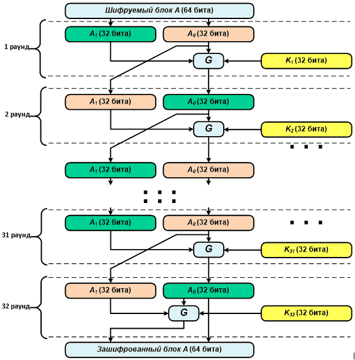
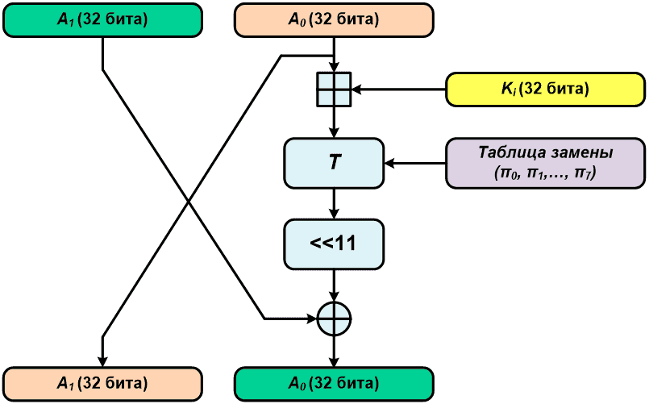
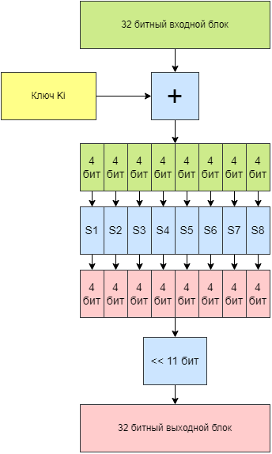
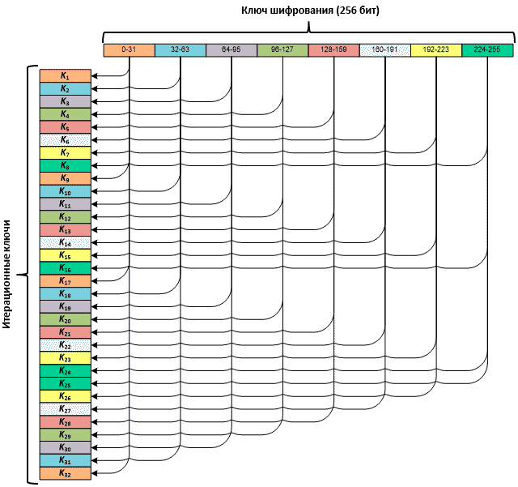
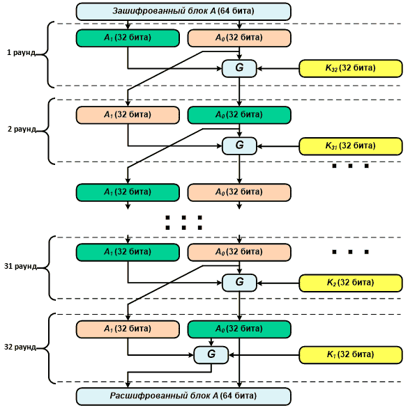

# Шифрование Магма

Алгоритм шифрования Магма представляет собой точную копию алгоритма блочного шифрования из старого ГОСТ 28147—89, за некоторым исключением. 

«Магма» является частью стандарта ГОСТ Р 34.12-2015, а позже частью стандарта ГОСТ 34.12-2018. В 2020 году алгоритм «Магма» был опубликован в виде RFC 8891.

Особенности:

- использование фиксированного узла замены id-tc26-gost-28147-param-Z;
- значение ключа читается как одно целое число с прямым порядком байт (в отличие от обратного порядка байт, используемого в ГОСТ 28147-89), что в результате даёт другие раундовые ключи;
- шифруемые данные тоже читаются как целое число с прямым порядком байт (в отличие от обратного порядка байт, используемого в ГОСТ 28147-89).

В новом ГОСТ 34.12—2015 определена и задана таблица перестановок для нелинейного биективного преобразования, которая в старом ГОСТ 28147—89 отсутствовала, и задание ее элементов полностью отдавалось в руки людей, реализующих данный алгоритм. Теоретически, если определить элементы таблицы перестановок самостоятельно и сохранить таблицу в тайне, это позволит увеличить стойкость алгоритма шифрования (за счет этого фактически увеличивается длина ключа), однако, как видим, разработчики ГОСТ 34.12—2015 решили лишить самостоятельности пользователей стандарта.

Как уже было сказано, длина шифруемого блока в алгоритме «Магма» — 64 бита. Длина ключа шифрования — 256 бит.

!!! При чтении ГОСТа учти, что во всех 8-байтовых массивах тестовых последовательностей нулевой байт находится в конце массива, а седьмой, соответственно, в начале (если ты внимательно читал статьи про «Стрибог» и «Кузнечик», то эта особенность наших криптостандартов тебе должна быть знакома).

## Немного теории о шифровании Магма

В описываемом алгоритме блок, подлежащий зашифровыванию (напомню, его длина 64 бита), разделяется на две равные по длине (32 бита) части — правую и левую. Далее выполняется тридцать две итерации с использованием итерационных ключей, получаемых из исходного 256-битного ключа шифрования.



Во время каждой итерации (за исключением тридцать второй) с правой и левой половиной зашифровываемого блока производится одно преобразование, основанное на сети Фейстеля. Сначала правая часть складывается по модулю 32 с текущим итерационным ключом, затем полученное 32-битное число делится на восемь 4-битных и каждое из них с использованием таблицы перестановки преобразуется в другое 4-битное число (если помнишь, то в предыдущих двух статьях это называлось нелинейным биективным преобразованием). После этого преобразования полученное число циклически сдвигается влево на одиннадцать разрядов. Далее результат ксорится с левой половиной блока. Получившееся 32-битное число записывается в правую половину блока, а старое содержимое правой половины переносится в левую половину блока.





В ходе последней (тридцать второй) итерации так же, как описано выше, преобразуется правая половина, после чего полученный результат пишется в левую часть исходного блока, а правая половина сохраняет свое значение.

Итерационные ключи получаются из исходного 256-битного ключа. Исходный ключ делится на восемь 32-битных подключей, и далее они используются в следующем порядке: три раза с первого по восьмой и один раз с восьмого по первый.



Для расшифровывания используется такая же последовательность итераций, как и при зашифровывании, но порядок следования ключей изменяется на обратный.



## Базовые функции стандарта шифрования Магма

Поскольку в алгоритме используются 32-битные блоки (в виде так называемых двоичных векторов), для начала определим этот самый блок:

```cpp
// Размер блока 4 байта (или 32 бита)
#define BLOCK_SIZE 4
...
// Определяем тип vect как 4-байтовый массив
typedef uint8_t vect[BLOCK_SIZE];
Сложение двух двоичных векторов по модулю 2
```

Каждый байт первого вектора ксорится с соответствующим байтом второго вектора, и результат пишется в третий (выходной) вектор:

```cpp
static void GOST_Magma_Add(const uint8_t *a, const uint8_t *b, uint8_t *c)
{
  int i;
  for (i = 0; i < BLOCK_SIZE; i++)
    c[i] = a[i]^b[i];
}
```

## Сложение двух двоичных векторов по модулю 32

Данная функция аналогична функции под названием «сложение в кольце вычетов по модулю 2 в степени n» из алгоритма «Стрибог», за исключением того, что n в нашем случае будет равно 32, а не 512, как в стандарте «Стрибог». Два исходных 4-байтовых вектора представляются как два 32-битных числа, далее они складываются, переполнение, если оно появляется, отбрасывается:

```cpp
static void GOST_Magma_Add_32(const uint8_t *a, const uint8_t *b, uint8_t *c)
{
  int i;
  unsigned int internal = 0;
  for (i = 3; i >= 0; i--)
  {
    internal = a[i] + b[i] + (internal >> 8);
    c[i] = internal & 0xff;
  }
}
```

## Нелинейное биективное преобразование (преобразование T)

В отличие от алгоритмов «Стрибог» и «Кузнечик» (кстати, там это преобразование называется S-преобразованием) таблица перестановок здесь используется другая:

Идентификатор: id-tc26-gost-28147-param-Z
OID: 1.2.643.7.1.2.5.1.1

|Номер S-блока | 0 | 1 | 2 | 3 | 4 | 5 | 6 | 7 | 8 | 9 | A | B | C | D | E | F | 
|--------------|---|---|---|---|---|---|---|---|---|---|---|---|---|---|---|---|
|1             | C | 4 | 6 | 2 | A | 5 | B | 9 | E | 8 | D | 7 | 0 | 3 | F | 1 | 
|2             | 6 | 8 | 2 | 3 | 9 | A | 5 | C | 1 | E | 4 | 7 | B | D | 0 | F | 
|3             | B | 3 | 5 | 8 | 2 | F | A | D | E | 1 | 7 | 4 | C | 9 | 6 | 0 | 
|4             | C | 8 | 2 | 1 | D | 4 | F | 6 | 7 | 0 | A | 5 | 3 | E | 9 | B | 
|5             | 7 | F | 5 | A | 8 | 1 | 6 | D | 0 | 9 | 3 | E | B | 4 | 2 | C | 
|6             | 5 | D | F | 6 | 9 | 2 | C | A | B | 7 | 8 | 1 | 4 | 3 | E | 0 | 
|7             | 8 | E | 2 | 5 | 6 | 9 | 1 | C | F | 4 | B | 0 | D | A | 3 | 7 | 
|8             | 1 | 7 | E | D | 0 | 5 | 8 | 3 | 4 | F | A | 6 | 9 | C | B | 2 | 


```cpp
static unsigned char Pi[8][16]=
{
  {1,7,14,13,0,5,8,3,4,15,10,6,9,12,11,2},
  {8,14,2,5,6,9,1,12,15,4,11,0,13,10,3,7},
  {5,13,15,6,9,2,12,10,11,7,8,1,4,3,14,0},
  {7,15,5,10,8,1,6,13,0,9,3,14,11,4,2,12},
  {12,8,2,1,13,4,15,6,7,0,10,5,3,14,9,11},
  {11,3,5,8,2,15,10,13,14,1,7,4,12,9,6,0},
  {6,8,2,3,9,10,5,12,1,14,4,7,11,13,0,15},
  {12,4,6,2,10,5,11,9,14,8,13,7,0,3,15,1}
};
```


Поскольку в тексте стандарта (по неведомой традиции) нулевой байт пишется в конце, а последний в начале, то для корректной работы программы строки таблицы необходимо записывать в обратном порядке, а не так, как изложено в стандарте.

Код самой функции преобразования T получается такой:

```cpp 
static void GOST_Magma_T(const uint8_t *in_data, uint8_t *out_data)
{
  uint8_t first_part_byte, sec_part_byte;
  int i;
  for (i = 0; i < 4; i++)
  {
    // Извлекаем первую 4-битную часть байта
    first_part_byte = (in_data[i] & 0xf0) >> 4;
    // Извлекаем вторую 4-битную часть байта
    sec_part_byte = (in_data[i] & 0x0f);
    // Выполняем замену в соответствии с таблицей подстановок
    first_part_byte = Pi[i * 2][first_part_byte];
    sec_part_byte = Pi[i * 2 + 1][sec_part_byte];
    // «Склеиваем» обе 4-битные части обратно в байт
    out_data[i] = (first_part_byte << 4) | sec_part_byte;
  }
}
```

## Развертывание ключей

В начале мы уже говорили, что для зашифровывания и расшифровывания нам нужно тридцать два итерационных 32-битных ключа, которые получаются из исходного 256-битного.

Для начала определим место, где будут храниться полученные значения ключей:

```cpp
vect iter_key[32]; // Итерационные ключи шифрования
```

После чего можно заняться непосредственным развертыванием ключей:

```cpp
void GOST_Magma_Expand_Key(const uint8_t *key)
{
  // Формируем восемь 32-битных подключей в порядке следования с первого по восьмой
  memcpy(iter_key[0], key, 4);
  memcpy(iter_key[1], key + 4, 4);
  memcpy(iter_key[2], key + 8, 4);
  memcpy(iter_key[3], key + 12, 4);
  memcpy(iter_key[4], key + 16, 4);
  memcpy(iter_key[5], key + 20, 4);
  memcpy(iter_key[6], key + 24, 4);
  memcpy(iter_key[7], key + 28, 4);
 
  ...
  // Повторяем предыдущий кусочек кода еще два раза
  ...
 
  // Формируем восемь 32-битных подключей в порядке следования с восьмого по первый
  memcpy(iter_key[24], key + 28, 4);
  memcpy(iter_key[25], key + 24, 4);
  memcpy(iter_key[26], key + 20, 4);
  memcpy(iter_key[27], key + 16, 4);
  memcpy(iter_key[28], key + 12, 4);
  memcpy(iter_key[29], key + 8, 4);
  memcpy(iter_key[30], key + 4, 4);
  memcpy(iter_key[31], key, 4);
}
```
Итерационные ключи с примера ГОСТ:

```
K1=ccddeeff
K2=8899aabb
K3=44556677
K4=00112233
K5=f3f2f1f0
K6=f7f6f5f4
K7=fbfaf9f8
K8=fffefdfc
K9=ccddeeff
K10=8899aabb
K11=44556677
K12=00112233
K13=f3f2f1f0
K14=f7f6f5f4
K15=fbfaf9f8
K16=fffefdfc
K17=ccddeeff
K18=8899aabb
K19=44556677
K20=00112233
K21=f3f2f1f0
K22=f7f6f5f4
K23=fbfaf9f8
K24=fffefdfc
K25=fffefdfc
K26=fbfaf9f8
K27=f7f6f5f4
K28=f3f2f1f0
K29=00112233
K30=44556677
K31=8899aabb
K32=ccddeeff
```

Все это, конечно, можно написать с использованием циклов, но в данном случае эта функция реализована, так сказать, «в лоб» для наглядности, да и работать она в таком виде теоретически должна быстрее.

## Преобразование g

Это преобразование включает в себя сложение правой части блока с итерационным ключом по модулю 32, нелинейное биективное преобразование и сдвиг влево на одиннадцать разрядов:

``` cpp
static void GOST_Magma_g(const uint8_t *k, const uint8_t *a, uint8_t *out_data)
{
  uint8_t internal[4];
  uint32_t out_data_32;
  // Складываем по модулю 32 правую половину блока с итерационным ключом
  GOST_Magma_Add_32(a, k, internal);
  // Производим нелинейное биективное преобразование результата
  GOST_Magma_T(internal, internal);
  // Преобразовываем четырехбайтный вектор в одно 32-битное число
  out_data_32 = internal[0];
  out_data_32 = (out_data_32 << 8) + internal[1];
  out_data_32 = (out_data_32 << 8) + internal[2];
  out_data_32 = (out_data_32 << 8) + internal[3];
  // Циклически сдвигаем все влево на 11 разрядов
  out_data_32 = (out_data_32 << 11)|(out_data_32 >> 21);
  // Преобразовываем 32-битный результат сдвига обратно в 4-байтовый вектор
  out_data[3] = out_data_32;
  out_data[2] = out_data_32 >> 8;
  out_data[1] = out_data_32 >> 16;
  out_data[0] = out_data_32 >> 24;
}
```

## Преобразование G

Это преобразование представляет собой одну итерацию цикла зашифровывания или расшифровывания (с первой по тридцать первую). Включает в себя преобразование g, сложение по модулю 2 результата преобразования g с правой половиной блока и обмен содержимым между правой и левой частью блока:

```cpp
static void GOST_Magma_G(const uint8_t *k, const uint8_t *a, uint8_t *out_data)
{
  uint8_t a_0[4]; // Правая половина блока
  uint8_t a_1[4]; // Левая половина блока
  uint8_t G[4];
 
  int i;
  // Делим 64-битный исходный блок на две части
  for(i = 0; i < 4; i++)
  {
    a_0[i] = a[4 + i];
    a_1[i] = a[i];
  }
 
  // Производим преобразование g
  GOST_Magma_g(k, a_0, G);
  // Ксорим результат преобразования g с левой половиной блока
  GOST_Magma_Add(a_1, G, G);
 
  for(i = 0; i < 4; i++)
  {
    // Пишем в левую половину значение из правой
    a_1[i] = a_0[i];
    // Пишем результат GOST_Magma_Add в правую половину блока
    a_0[i] = G[i];
  }
 
  // Сводим правую и левую части блока в одно целое
  for(i = 0; i < 4; i++)
  {
    out_data[i] = a_1[i];
    out_data[4 + i] = a_0[i];
  }
}
```

## Финальное преобразование G

Это последняя (тридцать вторая) итерация цикла зашифровывания или расшифровывания. От простого преобразования G отличается отсутствием обмена значениями между правой и левой частью исходного блока:

```cpp
static void GOST_Magma_G_Fin(const uint8_t *k, const uint8_t *a, uint8_t *out_data)
{
  uint8_t a_0[4]; // Правая половина блока
  uint8_t a_1[4]; // Левая половина блока
  uint8_t G[4];
 
  int i;
  // Делим 64-битный исходный блок на две части
  for(i = 0; i < 4; i++)
  {
    a_0[i] = a[4 + i];
    a_1[i] = a[i];
  }
 
  // Производим преобразование g
  GOST_Magma_g(k, a_0, G);
  // Ксорим результат преобразования g с левой половиной блока
  GOST_Magma_Add(a_1, G, G);
  // Пишем результат GOST_Magma_Add в левую половину блока
  for(i = 0; i < 4; i++)
    a_1[i] = G[i];
 
  // Сводим правую и левую части блока в одно целое
  for(i = 0; i < 4; i++)
  {
    out_data[i] = a_1[i];
    out_data[4 + i] = a_0[i];
  }
}
```

## Шифрование Магма

Как мы уже говорили, шифрование производится путем тридцати двух итераций, с первой по тридцать первую с применением преобразования G и тридцать вторую с применением финального преобразования G:

```cpp
void GOST_Magma_Encript(const uint8_t *blk, uint8_t *out_blk)
{
  int i;
  // Первое преобразование G
  GOST_Magma_G(iter_key[0], blk, out_blk);
  // Последующие (со второго по тридцать первое) преобразования G
  for(i = 1; i < 31; i++)
    GOST_Magma_G(iter_key[i], out_blk, out_blk);
  // Последнее (тридцать второе) преобразование G
  GOST_Magma_G_Fin(iter_key[31], out_blk, out_blk);
}
```

Перед запуском данной функции не забудь вызвать GOST_Magma_ExpandKey, чтобы заполнить массив с итерационными ключами нужными значениями.

## Расшифровывание Магма

Расшифровывание выполняется аналогично зашифровыванию с использованием итерационных ключей в обратном порядке:

```cpp
void GOST_Magma_Decript(const uint8_t *blk, uint8_t *out_blk)
{
  int i;
  // Первое преобразование G с использованием
  // тридцать второго итерационного ключа
  GOST_Magma_G(iter_key[31], blk, out_blk);
  // Последующие (со второго по тридцать первое) преобразования G
  // (итерационные ключи идут в обратном порядке)
  for(i = 30; i > 0; i--)
    GOST_Magma_G(iter_key[i], out_blk, out_blk);
  // Последнее (тридцать второе) преобразование G
  // с использованием первого итерационного ключа
  GOST_Magma_G_Fin(iter_key[0], out_blk, out_blk);
}
```

Здесь также не стоит забывать про GOST_Magma_ExpandKey, так как для расшифровывания используются те же итерационные ключи, что и для зашифровывания.

```
Открытый текст:
1032547698badcfe
Зашифрованный текст:
3dcad8c2e501e94e
Расшифрованный текст:
1032547698badcfe
```
Алгоритм «Магма» из ГОСТ 34.12—2015 гораздо проще реализуется по сравнению с алгоритмом «Кузнечик» из того же ГОСТа, при этом на сегодняшний день он гораздо чаще используется (в том числе и в варианте ГОСТ 28147—89 с таблицами замены, определяемыми разработчиками самостоятельно или руководствуясь методическим документом RFC 4357).

Процедуры шифрования больших объемов, а также режимы работы (а именно режим простой замены, режим гаммирования, режим гаммирования с обратной связью по выходу, режим простой замены с зацеплением, режим гаммирования с обратной связью по шифртексту и режим выработки имитовставки) этих двух алгоритмов изложены в другом нормативном документе: ГОСТ 34.13—2015 «Информационная технология. Криптографическая защита информации. Режимы работы блочных шифров». 


