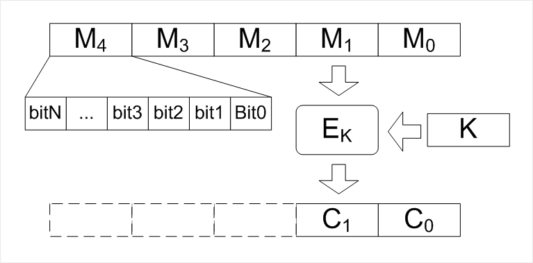

# Симметричные блочные шифры

Бло́чный шифр — разновидность симметричного шифра, оперирующего группами бит фиксированной длины — блоками, характерный размер которых меняется в пределах 64‒256 бит. Если исходный текст (или его остаток) меньше размера блока, перед шифрованием его дополняют. Фактически, блочный шифр представляет собой подстановку на алфавите блоков, которая, как следствие, может быть моно- или полиалфавитной. Блочный шифр является важной компонентой многих криптографических протоколов и широко используется для защиты данных, передаваемых по сети.

В отличие от шифроблокнота, где длина ключа равна длине сообщения, блочный шифр способен зашифровать одним ключом одно или несколько сообщений суммарной длиной больше, чем длина ключа. Передача малого по сравнению с сообщением ключа по зашифрованному каналу — задача значительно более простая и быстрая, чем передача самого сообщения или ключа такой же длины, что делает возможным его повседневное использование. Однако, при этом шифр перестаёт быть невзламываемым. От поточных шифров работа блочного отличается обработкой бит группами, а не потоком. При этом блочные шифры медленнее поточных. 

Симметричные системы обладают преимуществом над асимметричными в скорости шифрования, что позволяет им оставаться актуальными, несмотря на более слабый механизм передачи ключа (получатель должен знать секретный ключ, который необходимо передать по уже налаженному зашифрованному каналу. В то же время, в асимметричных шифрах открытый ключ, необходимый для шифрования, могут знать все, и нет необходимости в передаче ключа шифрования).

К достоинствам блочных шифров относят сходство процедур шифрования и расшифрования, которые, как правило, отличаются лишь порядком действий. Это упрощает создание устройств шифрования, так как позволяет использовать одни и те же блоки в цепях шифрования и расшифрования. Гибкость блочных шифров позволяет использовать их для построения других криптографических примитивов: генератора псевдослучайной последовательности, поточного шифра, имитовставки и криптографических хешей.

## Базовые математические элементы

[Сеть Фействеля](Feistel.md)

[Подстановочно-перестановочная сеть](SP.md)

## Режимы работы блочных шифров

[Режимы блочных шифров](CiperModes.md)

## Алгоритмы на основе сети Фейстеля

### DES

[DES](DES.md) (англ. Data Encryption Standard) — алгоритм для симметричного шифрования, разработанный фирмой IBM и утверждённый правительством США в 1977 году как официальный стандарт (FIPS 46-3). Размер блока для DES равен 64 битам. В основе алгоритма лежит сеть Фейстеля с 16 циклами (раундами) и ключом, имеющим длину 56 бит. Алгоритм использует комбинацию нелинейных (S-блоки) и линейных (перестановки E, IP, IP-1) преобразований.

### Алгоритм шифрования ГОСТ 34.12-2015 (2018) - Магма

[Шифрование Магма](Magma.md)

ГОСТ 28147-89 «Системы обработки информации. Защита криптографическая. Алгоритм криптографического преобразования» — устаревший (см. хронологию использования) государственный стандарт СССР (а позже межгосударственный стандарт СНГ), описывающий алгоритм симметричного блочного шифрования и режимы его работы.

Является примером DES-подобных криптосистем, созданных по классической итерационной схеме Фейстеля.

Работы над алгоритмом, положенным впоследствии в основу стандарта, начались в рамках темы «Магма» (защита информации криптографическими методами в ЭВМ ряда Единой Системы) по поручению Научно-технического совета Восьмого главного управления КГБ СССР (ныне в структуре ФСБ), в марте 1978 года после длительного предварительного изучения опубликованного в 1976 году стандарта DES. В действительности работы по созданию алгоритма (или группы алгоритмов), схожего с алгоритмом DES, начались уже в 1976 году.

Изначально работы имели гриф «Совершенно секретно». Затем были понижены до грифа «Секретно». В 1983 году гриф алгоритма был понижен до пометки «Для служебного пользования». Именно с последней пометкой алгоритм был подготовлен для публикации в 1989 году. 9 марта 1987 года группа разработчиков-криптографов (заявитель — в/ч 43753) получила авторское свидетельство с приоритетом № 333297 на изобретение на устройство шифрования по алгоритму «Магма-2».

## Алгоритмы на основе SP-сети

### AES

[Шифрование AES](AES.md)

### Алгоритм шифрования ГОСТ 34.12-2015 (2018) - Кузнечик

[Кузнечик](Kuznetchik.md) — симметричный алгоритм блочного шифрования с размером блока 128 бит и длиной ключа 256 бит, использующий для генерации раундовых ключей SP-сеть.
